# TubeChord — Workflow Architecture

## High-Level Pipeline

```mermaid
flowchart TD
    User(["👤 User\ntubechord URL --grade N"])

    User -->|YouTube URL + options| CLI

    subgraph CLI["cli.py — Orchestrator"]
        direction TB
        CLIStart([fa:fa-terminal main])
        GradeSelect{{"--grade\n1 or 2?"}}
        CLIStart --> GradeSelect
    end

    GradeSelect -->|grade 1| G1["Grade1Voicer"]
    GradeSelect -->|grade 2| G2["Grade2Voicer"]

    CLI -->|url| AP

    subgraph AP["AudioProcessor (context manager)"]
        direction TB
        DL["download_audio()\nyt-dlp → temp WAV"]
        EX["extract_chroma()\nlibrosa chroma_stft"]
        DL --> EX
    end

    EX -->|"chroma (12 × N frames)\nhop_duration (s/frame)"| CA

    subgraph CA["ChordAnalyzer"]
        direction TB
        SM["_smooth_chroma()\nnp.convolve box filter\nwindow = 9 frames"]
        FD["_detect_frame_chord()\nargmax → root\nminor3rd vs major3rd energy"]
        MG["Merge consecutive frames\nDiscard < min_duration"]
        SM --> FD --> MG
    end

    MG -->|"list[ChordEvent]\nroot, chord_type,\nstart_time, duration"| VS

    subgraph VS["VoicingStrategy"]
        direction TB
        G1["Grade1Voicer\nRH triads octave 4\nno LH"]
        G2["Grade2Voicer\nRH triads octave 4\nLH bass octave 3"]
    end

    VS -->|"list[VoicedChord]\nright_hand_notes[]\nleft_hand_notes[]"| ME

    subgraph ME["MidiExporter"]
        direction TB
        T0["Track 0 — Left Hand Bass\nChannel 0 | velocity 68"]
        T1["Track 1 — Right Hand Chords\nChannel 1 | velocity 80"]
        SEC["seconds → beats\nbeats = secs × (tempo / 60)"]
        SEC --> T0
        SEC --> T1
    end

    ME -->|writes| MIDI[/"output.mid\n(SMF Format 1, 2 tracks)"/]
    MIDI --> DAW(["GarageBand / MuseScore\n/ any MIDI player"])
```



---

## Data Flow in Detail

```mermaid
flowchart LR
    URL["YouTube URL"] -->|yt-dlp + ffmpeg| WAV["temp WAV\n(auto-deleted on exit)"]
    WAV -->|librosa.load| Signal["Audio signal y\nSample rate sr"]
    Signal -->|chroma_stft\nhop=512, n_fft=2048| Chroma["Chroma matrix\nshape: 12 × N"]
    Chroma -->|np.convolve\nwindow=9| Smoothed["Smoothed chroma\nshape: 12 × N"]
    Smoothed -->|per-frame argmax| Root["Root pitch class\n0=C … 11=B"]
    Smoothed -->|energy at root+3\nvs root+4| Quality["chord_type\nmajor / minor"]
    Root & Quality -->|consecutive merge\n+ min_duration filter| Events["list[ChordEvent]"]
    Events -->|semitone intervals\n[0,4,7] or [0,3,7]| Voiced["list[VoicedChord]\nMIDI note numbers"]
    Voiced -->|MIDIFile.addNote| File["output.mid"]
```

---

## Class Relationships


---

## Grade Voicing Comparison

```mermaid
flowchart LR
    subgraph Grade1["Grade 1"]
        direction TB
        G1RH["Right Hand — octave 4\ne.g. C major → C4 E4 G4\nMIDI 60, 64, 67"]
        G1LH["Left Hand — empty"]
    end

    subgraph Grade2["Grade 2"]
        direction TB
        G2RH["Right Hand — octave 4\ne.g. C major → C4 E4 G4\nMIDI 60, 64, 67"]
        G2LH["Left Hand — octave 3\ne.g. C major → C3\nMIDI 48"]
    end
```


